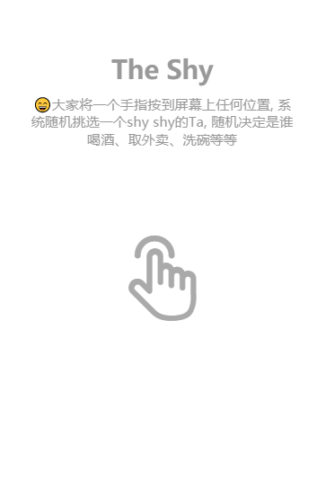

# The shy

> 😄大家手指按到屏幕上随机挑选一个shy shy的Ta, 随机决定是谁喝酒、取外卖、洗碗等等

[Demo 点击这里试试](https://ajlovechina.github.io/theshy/)



## Project setup
```
yarn install
```

### Compiles and hot-reloads for development
```
yarn run serve
```

### Compiles and minifies for production
```
yarn run build
```

### Run your tests
```
yarn run test
```

### Lints and fixes files
```
yarn run lint
```

### Customize configuration
See [Configuration Reference](https://cli.vuejs.org/config/).
